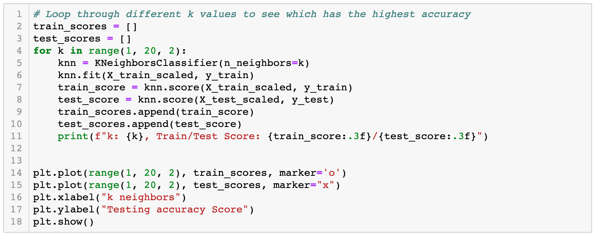
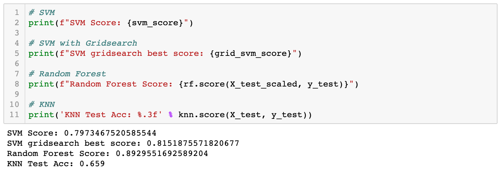

# Exoplanet Machine Learning Models

Create machine learning models capable of classifying candidate exoplanets from the raw dataset.

## Table of contents

* [General info](#general-info)
* [Technologies](#technologies)
* [Development Process](#development-process)
* [Resources](#resources)
* [Contact](#contact)

## General info

Over a period of nine years in deep space, the NASA Kepler space telescope has been out on a planet-hunting mission to discover hidden planets outside of our solar system.

To help process this data, I have created machine learning models capable of classifying candidate exoplanets from the raw dataset.

## Technologies

### Language Used

* Python

### Data Extraction and Munging

* Jupyter notebook - version 4.1
* Pandas - version 0.23.4
* Matplotlib - version 3.0.3

### Machine Learning

* scikit-learn - version 0.21.3

## Development Process

### Preprocess Data

#### Import Raw Data and Perform Basic Data Cleaning

* Select features to use in modeling and drop the rest.
* Drop samples with null values in selected features.
* Cast non-floats as floats.

#### Create a Test-Train Split

* Select koi_disposition for the y values.
* Use `sklearn.model_selection train_test_split` to split data by default 75% : 25% split.

#### Scale Data

* Scale data using `MinMaxScaler.`

## Create Machine Learning Models

### Support Vector Machine

* With parameter `gamma="auto`, classifier score is 0.797.
* With hyperparameter tuning using `GridSearchCV`:

classifier score is 0.832 with parameters `C=10` and `gamma = 0.01`.

### Random Forest Classifier

* Using `n_estimators = 200`, classifier score is .893.

### KNN Classifier

* Using parameter `k in range(1, 20, 2)`:

classifier score is 0.659 with `k: 15`.

## Evaluate Model Performance

Random Forest using `n_estimators = 200` creates the best score of .893.

## Resources

* [Exoplanet Data Source](https://www.kaggle.com/nasa/kepler-exoplanet-search-results)

## Contact

Created by [Gretel Uptegrove](https://gretelup.github.io/)