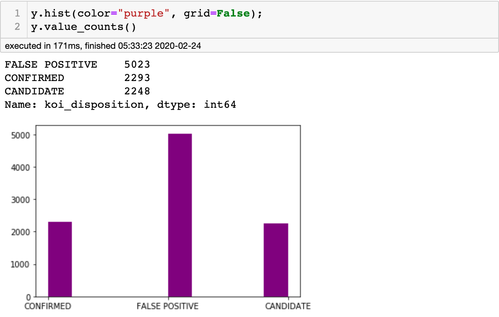
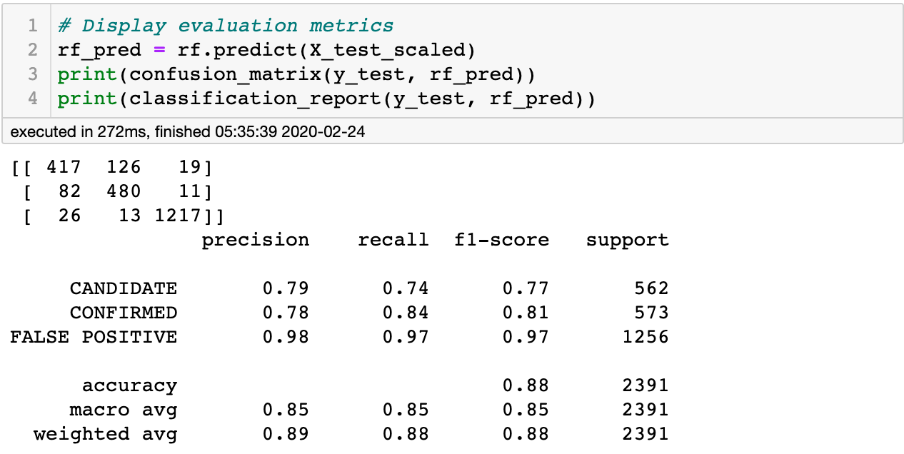
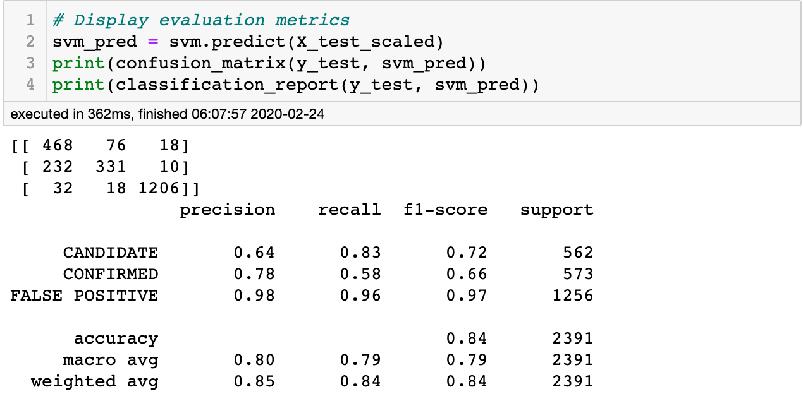
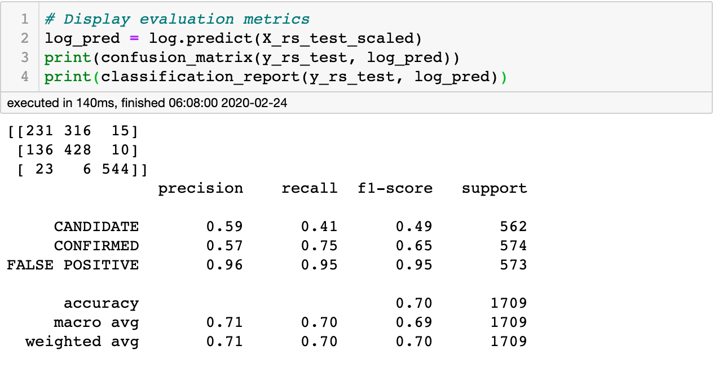

# Exoplanet Machine Learning Models

Create machine learning models capable of classifying candidate exoplanets from the raw dataset.

## Table of contents

* [General info](#general-info)
* [Technologies](#technologies)
* [Development Process](#development-process)
* [Resources](#resources)
* [Contact](#contact)

## General info

Over a period of nine years in deep space, the NASA Kepler space telescope has been out on a planet-hunting mission to discover hidden planets outside of our solar system.

To help process this data, I have created machine learning models capable of classifying candidate exoplanets from the raw dataset.

## Technologies

### Language Used

* Python

### Data Extraction and Munging

* Jupyter notebook - version 4.1
* Pandas - version 0.23.4
* Matplotlib - version 3.0.3

### Machine Learning

* scikit-learn - version 0.21.3

## Development Process

### Preprocess Data

#### Import Raw Data and Perform Basic Data Cleaning

1. Select features to use in modeling and drop the rest.

    * The idea behind this project is to determine the category of a Kepler object of interest based on observed values. `Koi_pdisposition` and `koi_score` are derived from the data and related to `koi_disposition`, which is the target; therefore, I dropped them.
    * The following columns are simply multiple ways of referring to the same objects of interest: `kepid`, `kepoi_name`, `kepler_name`. As these will not be used as features, I dropped them.
    * `Koi_tce_delivname` is a unique string label corresponding to TCE data and will also be dropped.
    * All of the columns tagged w/ "err" indicate uncertainty in the corresponding measurement. As the measurements in and of themselves can not be used in a model, as the are related to other measurements, the options are to perform some calculation on these data, creating new features, or dropping the columns. I have decided to drop the columns.

2. Verify data is of correct type and "makes sense."

3. Manage missing data

    * There were over 350 data points missing from multiple columns out of only 9564 records, a not insignificant portion of the dataset.
    * As I did not want to lose data that could be valuable in the model, I will inpute the data using knn, which tends to be more accurate than many other inputation methods. Its biggest drawback is that it is computationally expensive; however, as this dataset is relatively small, this should not be an issue.

#### Feature Selection

##### Outliers

From getting basic statistical information and viewing the distribution of the data, I gathered that there is very skewed distribution on some features, some of which are definitely caused by outliers. For example, the "koi_period" has 75% of the data <= 40.7, with a max of 130,000 and a standard deviation of 1334. I then further visualized this with boxplots.

The boxplots show that many features have a not insignificant number of outliers. For this reason, I left the outliers as is to later consider managing them when choosing a model.

##### Feature Importance

There are various methods of determining feature importance. Here, I used two model-based approaches--KNN and Extra-Tree classifiers.

I chose the top three features from each list and then any features that occured on both lists.

#### Check distribution of Target

* A count and histogram displayed that there is a significant imbalance in the dataset.

* While the `Confirmed` and `Candidate` classes were rougly equal, the `False Positive` class had more than both combined.
* I compensated for this imbalance in my model selection and accuracy metrics used to evaluate.

#### Create a Test-Train Split

* Select `koi_disposition` for the y values.
* Use `sklearn.model_selection train_test_split` to split data by default 75% : 25% split.
* Stratified data as distribution is skewed.

#### Scale Data

* Scale data using `StandardScaler`

## Create Machine Learning Models

### Random Forest Classifier

Random Forest Classifiers tend to work well for for muti-class classification problems, especially with unbalanced data.

* Used `GridSearchCV` to determine the best hyperparameters for the model.
* Displayed confusion matrix and classification report to determine evaluation metrics for the model.

  * Precision is the ratio of samples with that class being correctly predicted to the total number of samples.
  * Recall is the ratio of samples with that correct class to the total instances of that class (including those incorrectly labeled).
  * F1 score is an accuracy metric that takes both recall and precision into account.
  * Support is the number of actual occurrences of the class.
  * From this we can see that the random forest works very well at predicting false positives, pretty well at predicting candidates, and ok at predicting confirmed
  * The reason for these discrepancies is the imbalanced set. All of these metrics will be considered for model comparison.

### Penalized Support Vector Machine

Support Vector Machines can also be used for multi-class classifiction problems. To account for the imbalanced dataset, I used a penalized SVM model.

* To do this, I set the hyperparameter `class_weight` to "balanced," which penalizes mistakes on the minority classes by an amount proportional to how under-represented it is. Additionally, I set the hyperparameter `probability` to "True" so as to enable probability estimates.
* Used `GridSearchCV` to determine best hyperparameters for model.
* Displayed confusion matrix and classification report to determine evaluation metrics for the model.

  * From this we can see that the SVM works almost as well as the Random Forest model, but it underperforms it in all metrics.

### Logistic Regression with Rebalanced Data

Logistic regression is a solid muti-class classifier; however, to use it on an imbalanced dataset, rebalancing the dataset will result in the best accuracy.

The two main methods of rebalancing a dataset are to upsample and downsample the set. The first will add more samples of the minority class to the data. The latter will remove samples of the majority class to the data. As upscaling would be repeating a great number of records, I decided to downscaled the majority class.

* Downsampled majority class by recombining original dataset, separating by class, and then using .sample to select a sample equivalent to the number of records in one of the minority classes.
* After separating, scaling, and splitting the data into testing and training, fit the model using GridSearchCV to find best hyperparameters
* When attempting to fit the model, an error arose saying the data did not converge; so, I increased the number of iterations to 1000 instead of 100.
* Displayed confusion matrix and classification report to determine evaluation metrics for the model.

  * From this we can see that the logistic regression model underpreforms both prior models for all metrics.

### Choose Best model

As all of the metrics were the highest for the random forest, I determined that is the best classifier.

## Resources

* [Exoplanet Data Source](https://www.kaggle.com/nasa/kepler-exoplanet-search-results)

## Contact

Created by [Gretel Uptegrove](https://gretelup.github.io/)